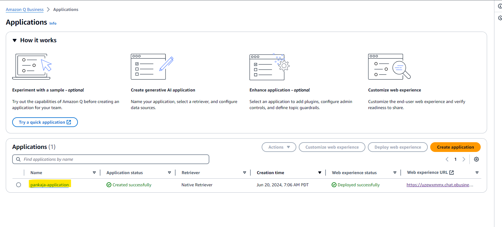
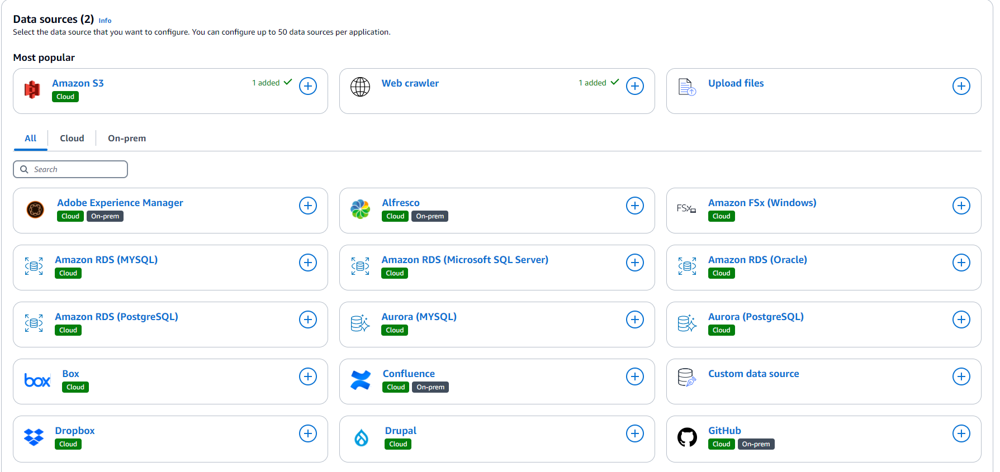
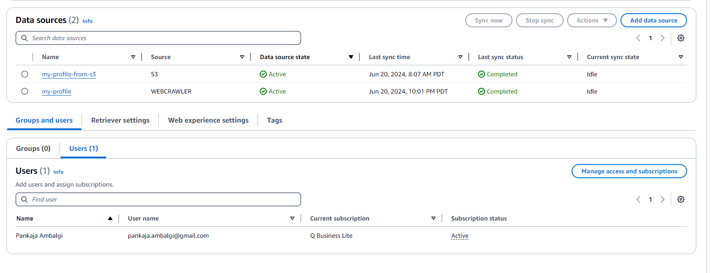
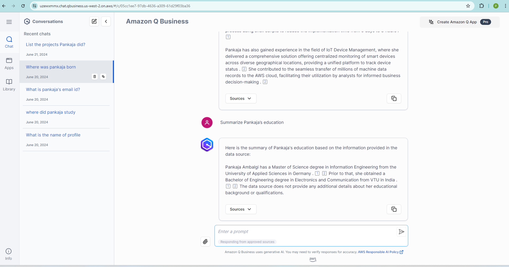

# Generative AI chatbot for business

## Tech stack

* AWS Q
* AWS S3
* IAM Identity center

This application was built on AWS Q Business service. Q helped us in setting up chatbot in no time. 

## Steps to create application on AWS Q for Business
1. Create application AWS Q
   1. From the AWS management console create an application.
   2. Choose a method to authorize AWS Q. I created new service role for Q to access AWS resources to create an application.
   3. Next step is to connect the Q application to the IAM Identity Center. This will allow Users from IAM Identity Center to add to our application.
   4. The application will be created now
2. Connecting Data Sources.
   1. Q has number of options to add as data sources for the chat application. For example S3, Websites, Databases, Repositories, Atlassian applications, GMail, Google drive and many more.
      1. I connected two data sources, my AWS S3 bucket and my Website for the application to retrieve. Once we select the data source, there are options to sync the source daily, weekly, monthly, on demand. 
      During sync it goes through two stages.
         1. Crawling
         2. Indexing
   2. If you have AWS Kendra Retriever set up. This can be connected as retriever to Q application.
   3. The sync of data sources might take some minutes, in this case it was about 20 minutes.
3. Adding Users
   1. Q allows to give access to users created in the IAM Identity center. To create new user, you need to provide general details, first name, last name, email id.
   2. The user will be notified about the access with initial password to reset.
4. Deploy the application
   1. Q application once deployed gives us an URL. This URL will take us to a chatbot home page. Now the application is ready to answer the questions and interact with the user about the connected sources.

## Screenshots of the Q application

### 1. Application created

### 2. Data sources added

### 3. User created in IAM Identity Center

### 4. Chatbot application

### Conclusion:

In summary, the AWS Q provides quick set up of chatbot application by connecting to companies data sources. 
It streamlines tasks in workplace, accelerates content creation, generates key insights and much more. It is a powerful must tool for a business to have.
