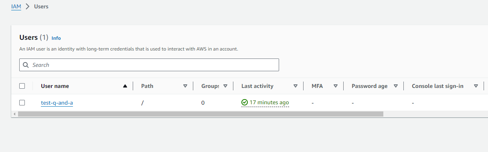
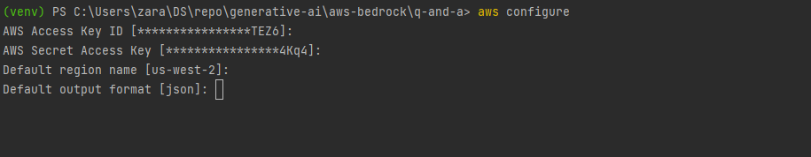
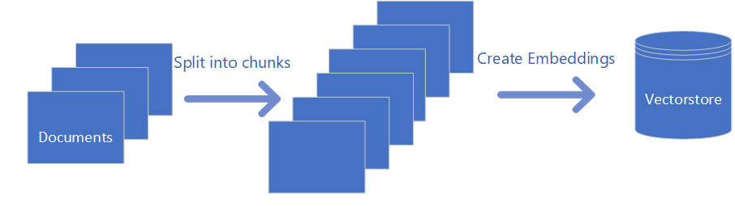
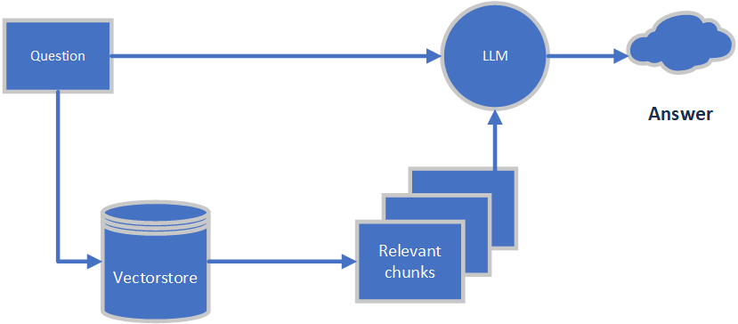

# Q and A application with LLM models

## Steps to run the application
1. Install dependencies listed in requirements.txt on the system.
2. AWS Prerequisites
   1. Create the AWS account
   2. Create a User in IAM account with below accesses(access can be finetuned, here I have given full access for simplicity),
      1. AdministratorAccess
      2. AmazonBedrockFullAccess 
      
   
   3. Configure AWSCLI on your system by giving the Access key and Secret Key. Follow this [link](https://docs.aws.amazon.com/cli/v1/userguide/cli-chap-configure.html) for steps.
    
   4. Request access to required LLM models in AWS Bedrock from AWS Management console. Here is the [Link](https://us-west-2.console.aws.amazon.com/bedrock/home?region=us-west-2#/modelaccess) for requesting model access. 
      Here we need following LLM models. 
      1. [Titan Embeddings G1-Text](https://us-west-2.console.aws.amazon.com/bedrock/home?region=us-west-2#/providers?model=amazon.titan-embed-text-v1): Required for creating Embeddings. 
      2. [Llama2 Chat 13B](https://us-west-2.console.aws.amazon.com/bedrock/home?region=us-west-2#/providers?model=meta.llama2-13b-chat-v1): LLM model for Text generation. 
      3. [Jurassic](https://us-west-2.console.aws.amazon.com/bedrock/home?region=us-west-2#/providers?model=ai21.j2-mid-v1): For text summarization, question answering.
      4. [Llama3](https://us-west-2.console.aws.amazon.com/bedrock/home?region=us-west-2#/providers?model=meta.llama3-8b-instruct-v1:0): For text generation.
      5. [Mistral](https://us-west-2.console.aws.amazon.com/bedrock/home?region=us-west-2#/providers?model=amazon.titan-text-lite-v1): For text generation.
      6. [Titan Text G1 - Lite](https://us-west-2.console.aws.amazon.com/bedrock/home?region=us-west-2#/providers?model=amazon.titan-text-lite-v1): For text generation.

   5. Run

      \generative-ai\aws-bedrock\q-and-a>**streamlit run .\app.py**
      

## Tech stack

* AWS Bedrock
* Langchain
* Faiss Vectorstore
* Streamlit

The code showcases a comprehensive pipeline for interacting with PDF documents through a Streamlit application. Let's break down the functionality into coherent paragraphs:

### Data Ingestion and Text Chunk Splitting:

The process begins with data ingestion, where PDF documents are loaded using the `PyPDFDirectoryLoader`. These documents are then split into smaller text chunks using the `RecursiveCharacterTextSplitter`. This splitting mechanism ensures that the large documents are broken down into manageable pieces for further processing. By dividing the documents into smaller chunks, the application sets the stage for efficient analysis and retrieval of information.

### Embedding Generation and Vector Store Creation:

Once the documents are split, the next step involves generating embeddings for these text chunks. Leveraging the Titan embedding model accessed through the Bedrock service, the code uses the `BedrockEmbeddings` class to generate embeddings for each chunk. These embeddings capture semantic information about the text, enabling downstream tasks such as similarity search and question answering. The embeddings are then stored in a vector store using the `FAISS` library. This vector store acts as a repository for the embeddings, facilitating fast and accurate retrieval of relevant text chunks based on user queries.

### Fine-tuning Language Models for Question Answering:

The application offers users the option to fine-tune Language Model (LLM) models for question answering tasks. It provides two models: Jurassic and Llama2, both accessed through the Bedrock service. The code initializes these models using the `Bedrock` class with specific model IDs and parameters. These models are capable of generating responses to user queries based on the provided context and question. By fine-tuning these models, the application enhances its ability to provide accurate and informative answers to user queries, thereby improving the user experience.

### Streamlit Application and User Interaction:

The core functionality of the application is wrapped within a Streamlit interface, making it intuitive and accessible to users. Users can interact with the application by asking questions related to the PDF documents. They have the flexibility to choose between the Jurassic and Llama2 models for generating responses to their queries. Additionally, the application provides a convenient option to update the vector store, ensuring that it remains up-to-date with any changes or additions to the document collection.

### Conclusion:

In summary, the provided code presents a robust pipeline for processing PDF documents and enabling interactive question answering through a Streamlit application. By leveraging text chunk splitting, embedding generation, and fine-tuning of Language Models, the application offers a powerful tool for exploring and extracting insights from large document collections. With further refinement and customization, this pipeline holds the potential to address a wide range of information retrieval and analysis tasks across various domains.
